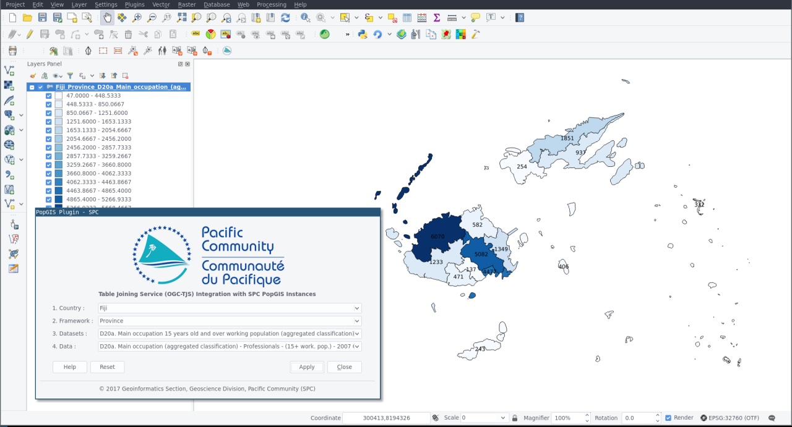
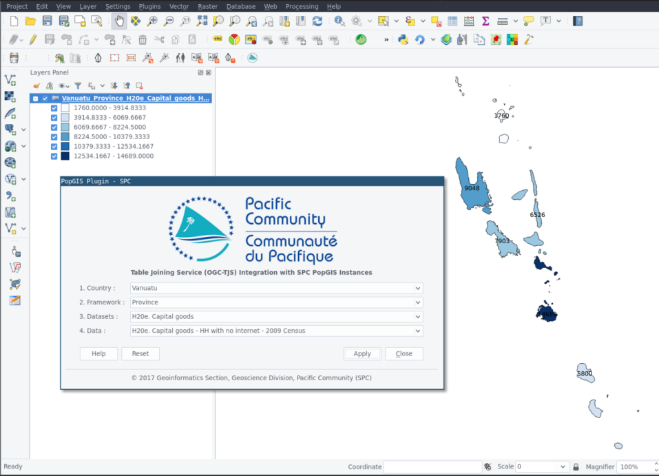

## QGIS Table Joining Service (QGC-TJS) Integration Plugin for SPC PopGIS

###### Installation
Requirement: QGIS 2.18.x 

1. Download the [latest release](https://github.com/sopac/popgis-plugin/releases) and extract them to your QGIS plugins folder at `$HOME/.qgis2/python/plugins/`
2. *Rename* the extracted folder to `PopGIS`.
3. Launch QGIS and open menu Plugins -> Manage and Install Plugins.
4. Enable *"SPC PopGIS"* plugin in the Plugins dialog.
5. Click on the SPC stars logo to launch the plugin.
6. Select Country, Framework, Datasets and Data before clicking the *Apply* button.

###### Reference
http://www.opengeospatial.org/standards/tjs

http://prism.spc.int/regional-data-and-tools/popgis2

###### Issues
File bugs and issues using GitHub Issues functionality on this repository.

###### Screenshots

